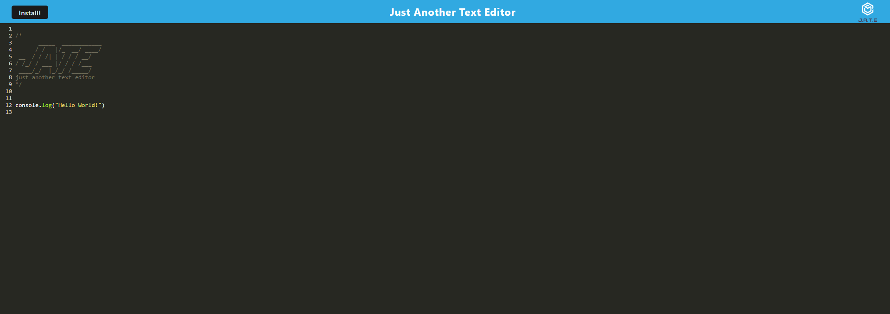

  # Just Another Text Editor

  
  ## Description

  This project is a simple text editor application that can be used both online and offline.  This app uses both indexedDB and webpack.
  
---
  ## Table of Contents

  * [Installation](#installation)
  * [Usage](#usage)
  * [License](#license)
  * [Contribution](#contribution)
  * [Tests](#tests)
  * [Questions](#questions)
---
  ## [Installation](#table-of-contents)

  To install, clone the repo, and then in the directory of your installed repo, use ```npm install``` to install all necessary dependencies.  You can then run the command ```npm start``` to start the application on your localhost.

---
  ## [Usage](#table-of-contents)

  To use this application, you may visit the  [Webpage](https://ar98-text-editor.herokuapp.com/) that is deployed on heroku for you to use. 

---
  ## [License](#table-of-contents)

  The application is covered under the following license:

  [MIT](https://choosealicense.com/licenses/MIT)

---
  ## [Contribution](#table-of-contents)

  To contribute, please contact me below.

---
  ## [Tests](#table-of-contents)

  To test the application, install it, and then you may add or remove features as you like.  You may want to change how the application works, so you may test that way!

---
  ## [Questions](#table-of-contents)

  Please use the following links for contact:

  [GitHub](https://github.com/areed98)

  [Email: austinjreed89@gmail.com](mailto:austinjreed89@gmail.com)
